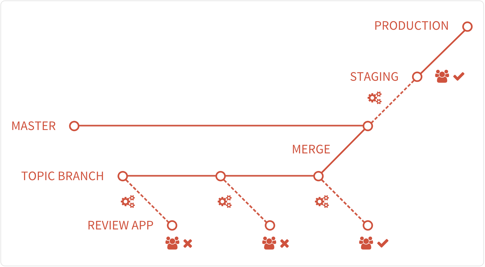

# smartpass-frontend

This is the frontend for the SmartPass system. It is an Angular web app.
It is used on Chromebooks primarily, but also as a PWA for Android devices.

## Setting up

To run the project, follow the below instructions:

- Install `nvm` by following this doc [https://github.com/nvm-sh/nvm](https://github.com/nvm-sh/nvm)
    If you get any issues on macOS, follow this instructions [https://github.com/nvm-sh/nvm#macos-troubleshooting](https://github.com/nvm-sh/nvm#macos-troubleshooting)
- cd into the root project directory
- `nvm use`
- `npm install -g yarn`
- `yarn install`
- `yarn run start`

### M1 Chip

If you're using a Macbook with an M1 chip, you're probably getting a memory error when you run `yarn install`.
This is because the NodeJS binary is building for a different architecture than the M1 chip.
Uninstalling node, manually switching to x64, and reinstalling node should solve the issue:

```bash
node -v # this is the <version> to uninstall
nvm uninstall <version>
arch -x86_64 zsh
nvm install <version>
nvm alias default <version>
```

## CI/CD

The `smartpass-frontend` project implements the following CI/CD process:



Topic/Feature branches should be created for each new task. When ready, a merge request should be opened targeting 
master. As soon as the MR is created, a preview deployment is created for that MR. Whenever the MR is updated, the 
preview deployment gets updated as well. There can be an infinite number of MRs open at the same time and 
an infinite number of preview deployments.

Once the task has been completed, and both the preview deployment and the MR itself has been reviewed and approved,
developers can merge their MR to master.

Once the MR is merged, the project will automatically be deployed to the staging environment. 
After reviewing on the staging environment, the exact deployment can be re-deployed to the production environment by
triggering a manual job.

## Code scaffolding

Run `ng generate component component-name` to generate a new component. You can also use `ng generate directive|pipe|service|class|guard|interface|enum|module`.
